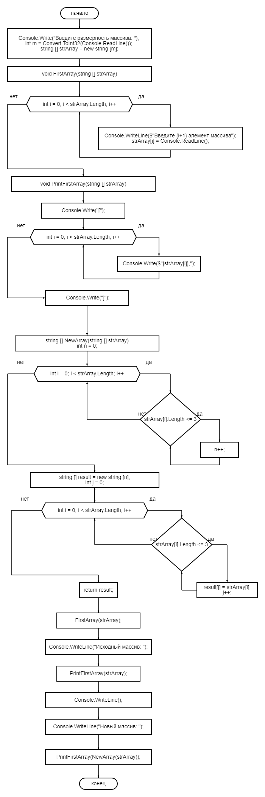

###**Для решения данной итоговой контрольной работы необходимо**:

1. Создать репозитой на GitHub

2. Нарисовать блок-схему алгоритма

3. Написать краткое описание решения итоговой контрольной работы с помощью файла README.md

4. Написать программу, решающую поставленную задачу: 

*Задача:* Написать программу, которая из имеющегося массива строк формирует новый массив из строк, длина которых меньше, либо равна 3 символам. Первоначальный массив можно ввести с клавиатуры, либо задать на старте выполнения алгоритма. При решении не рекомендуется пользоваться коллекциями, лучше обойтись исключительно массивами.

*Решение:*
* На первом этапе просим пользователя ввести размерность массива с клавиатуры.

* Далее пишем метод на  приём данных FirstArray, благодаря которому, пользователю будет выведен поэтапно запрос на ввод элементов массива с клавиатуры.

* Пишем метод PrintFirstArray, который выведет на печать все элементы введенного пользователем с клавиатуры массива.

* Пишем метод NewArray на создание нового массива из заданного пользователем элементов, который будет проверять каждый из элементов массива и показывать только те элементы, которые менее или равны 3 .

* Далее запускаем поэтапно наши методы. Дополнительно прописываем с помощью новой строки где будет находиться исходный массив, а где новый массив.

5. Добавляем нашу задачу при помощи dotnet

6. Создаём коммиты на создание блок-схемы, файла README.md и решение задачи 

